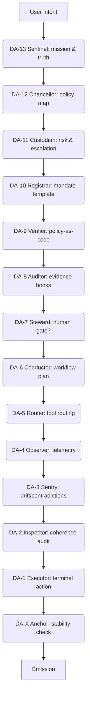

# DAX_DA13-DA13x2

DA-13 + DA-X ("Dax") is a stack of agents that checks and stabilizes model outputs before they ship. It drops into any app as a safety harness, adding policy checks, risk gates, and optional human review without forcing a new framework.

```mermaid
flowchart LR
  subgraph Governance Stack
    A[DA-13 Sentinel] --> B[DA-12 Chancellor]
    B --> C[DA-11 Custodian]
    C --> D[DA-10 Registrar]
    D --> E[DA-9 Verifier]
    E --> F[DA-8 Auditor]
    F --> G[DA-7 Steward]
    G --> H[DA-6 Conductor]
    H --> I[DA-5 Router]
    I --> J[DA-4 Observer]
    J --> K[DA-3 Sentry]
    K --> L[DA-2 Inspector]
    L --> M[DA-1 Executor]
    M --> N[DA-X Anchor]
  end
  Intent[[User intent]] --> A
  N --> Output[[Governed output]]
```



## Why Dax
- **Governance-first**: Thirteen passes plus the DA-X anchor catch drift, hallucination, and policy breaks before anything executes.
- **Framework-agnostic**: Works with browsers, CLIs, agent frameworks, or custom services through one recursion loop.
- **Auditable by default**: Layers can emit reasons and evidence so investigators can see why a decision was made.

## Quick start (local experiment)
1. **Clone & install**
   ```bash
   git clone https://github.com/your-org/DAX_DA13-DA13x2.git
   cd DAX_DA13-DA13x2
   ```
2. **Configure layer prompts**: Tune governance per domain in [`config/layers.json`](config/layers.json).
3. **Run a dry loop** (pseudo-code):
   ```javascript
   import { runDax } from './sdk/javascript/dax.js';

   const { output, audit } = await runDax('Summarize incident 42', {
     apiKey: process.env.XAI_API_KEY,
     includeReasons: true,
   });
   console.log(output, audit);
   ```
4. **Ship**: Plug in the overlay snippet or backend recipe in [`docs/INTEGRATION.md`](docs/INTEGRATION.md).

## Project layout
- `config/` – Layer prompts, policy templates, and tuning knobs.
- `docs/` – Guides for integration, releases, and architecture.
- `sdk/` – SDK stubs for browser, Node, and Python entrypoints.
- `tests/` – Safety and regression cases to extend for your stack.

## Documentation map
- **Integration**: Browser overlay, backend recipe, and environment expectations in [`docs/INTEGRATION.md`](docs/INTEGRATION.md).
- **Architecture**: Component responsibilities, lifecycle, and observability in [`docs/ARCHITECTURE.md`](docs/ARCHITECTURE.md).
- **Disambiguation agent**: Plain-language rewrite helper for verbose documentation in [`docs/DISAMBIGUATION_AGENT.md`](docs/DISAMBIGUATION_AGENT.md).
- **Releases**: Versioning expectations and delivery steps in [`docs/RELEASE.md`](docs/RELEASE.md).

## Core loop (conceptual)


## Next steps
- Add your domain policies to `config/layers.json` and run targeted tests.
- Extend SDK adapters to your toolchain; see [`docs/ARCHITECTURE.md`](docs/ARCHITECTURE.md) for component responsibilities.
- Wire telemetry to your observability stack for per-layer latency, retries, and drift alerts.

---

**Model note:** This repository assumes access to `grok-4` (or compatible) at `https://api.x.ai/v1/chat/completions`. Swap in your provider where needed.
