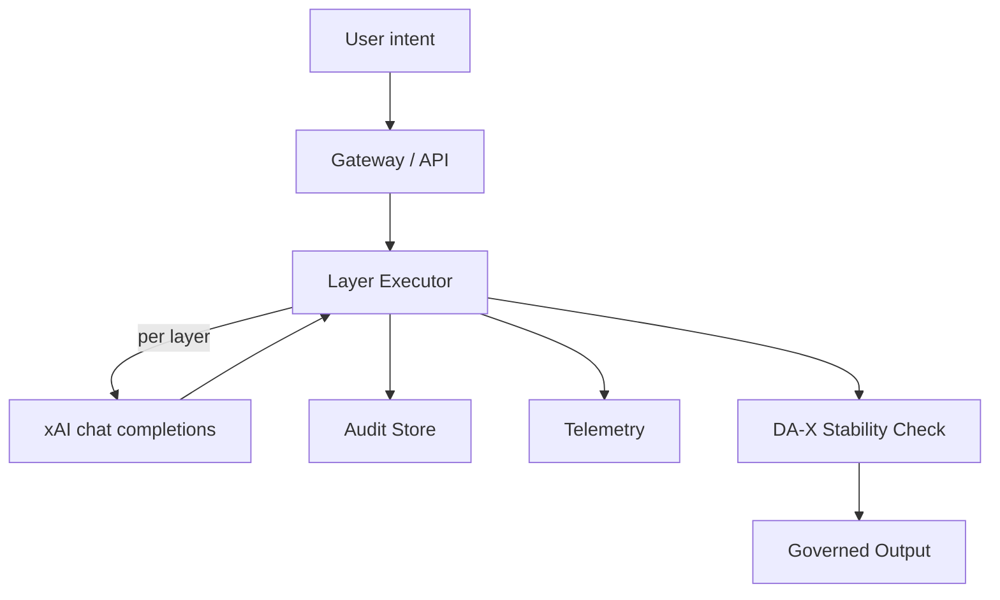
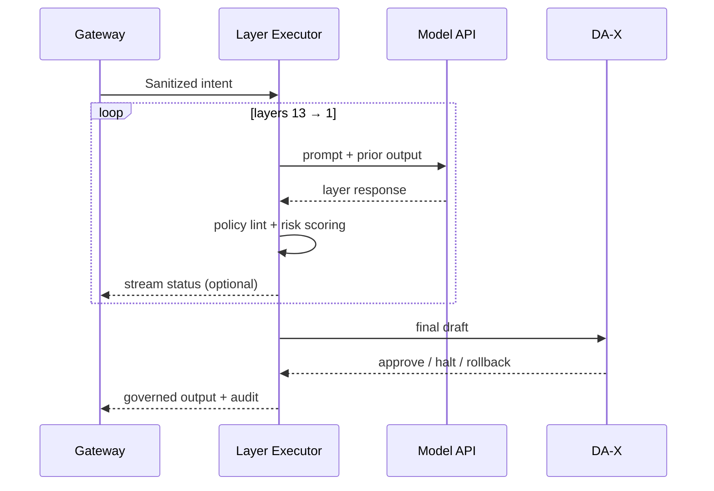

# Dax Architecture

This document explains how the DA-13 + DA-X loop works and how data moves between layers. Use it to align SDKs, services, and telemetry.

## High-level view

- **Gateway / API**: Authenticates requests, cleans payloads, and rate limits.
- **Layer Executor**: Walks through `config/layers.json`, applies prompts, and enforces safety knobs.
- **Audit Store**: Optional log of inputs, outputs, and reasons for later review.
- **Telemetry**: Emits per-layer timing, retries, anomalies, and escalation choices.
- **DA-X Stability Check**: Final halt or rollback if drift shows up after DA-1.

## Layer lifecycle

### Per-layer responsibilities
- **Prompting**: Pull `name`, `agent`, `desc`, and `prompt` from `config/layers.json` to build the request payload.
- **Safety enforcement**: Apply token limits, timeouts, and retries per layer to control cost.
- **Anomaly routing**: If DA-3 or DA-X flags drift, raise an incident and stop downstream actions.
- **Audit notes**: When `includeReasons` is on, save each layer's rationale with the stabilized text.

## Configuration surfaces
- **`config/layers.json`**: Source of truth for layer order, prompts, and optional overrides (temperature, stop sequences).
- **Environment variables**: `XAI_API_KEY`, circuit-breaker thresholds, telemetry targets.
- **SDK options**: `includeReasons`, custom transports, and retry policies.
- **Documentation helpers**: Optional plain-language pass (see [`docs/DISAMBIGUATION_AGENT.md`](DISAMBIGUATION_AGENT.md)).

## Deployment patterns
- **Sidecar**: Run the Gateway + Layer Executor beside your primary service and call over localhost.
- **Edge**: Put the Gateway at the edge to handle auth and forward to a central executor.
- **Agent middleware**: Wrap agent frameworks so every model action flows through Dax before execution.

## Observability checklist
- Emit latency, failure counts, retries, and DA-X halts per layer.
- Log audit trails with redaction to avoid PII leaks.
- Trace user requests to layer spans for root-cause analysis.

## Failure & recovery paths
- **Model errors**: Retry with backoff; drop to a fallback model if needed.
- **Policy violations**: Block emission and return a structured refusal with the rule ID.
- **Timeouts**: Stop remaining layers and return an error with partial audit data.

## Glossary
- **Stabilized text**: The output of a layer after applying its duties and constraints.
- **Drift**: A deviation from mission intent, policy, or truth that triggers DA-3 or DA-X intervention.
- **Audit trail**: Structured record of layer transitions, rationales, and any human approvals.
