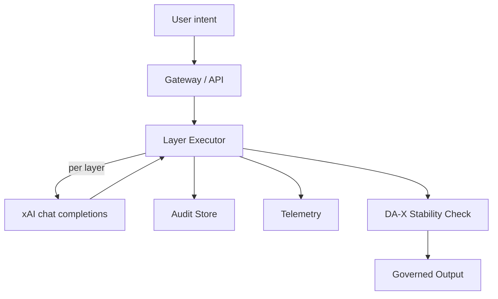
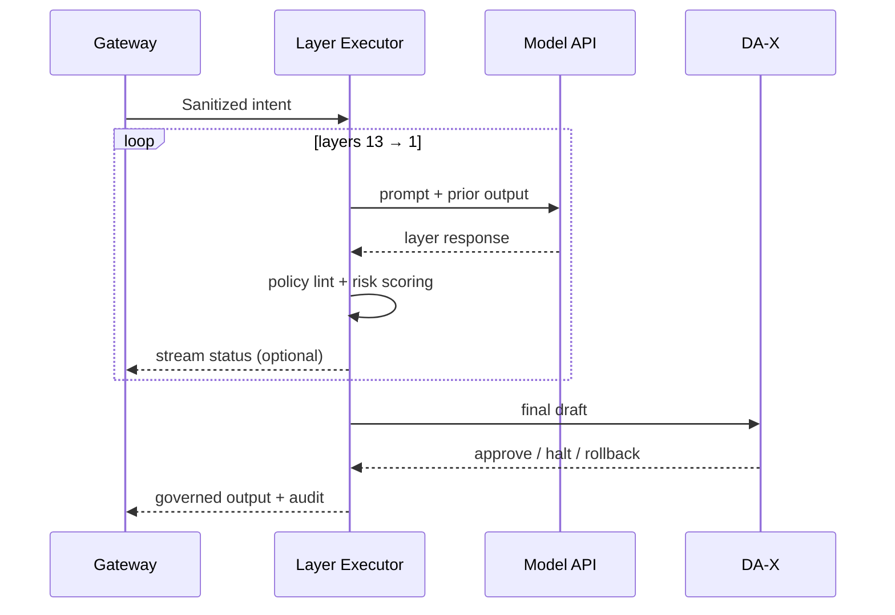

# Dax Architecture

This document describes the DA-13 + DA-X recursion engine, its responsibilities, and how data moves between layers. Use it to align SDKs, services, and observability pipelines.

## High-level view

- **Gateway / API**: Authenticates callers, normalizes payloads, and rate limits.
- **Layer Executor**: Iterates through `config/layers.json`, applying prompts and safety policies.
- **Audit Store**: Optional evidence log of inputs/outputs and rationales for investigations.
- **Telemetry**: Emits per-layer timings, retries, anomalies, and escalation decisions.
- **DA-X Stability Check**: Final halt/rollback mechanism if drift is detected after DA-1.

## Layer lifecycle

### Per-layer responsibilities
- **Prompting**: Use the `name`, `agent`, `desc`, and `prompt` fields from `config/layers.json` to build the request payload.
- **Safety enforcement**: Apply token limits, timeout, and retry policies per layer to prevent runaway costs.
- **Anomaly routing**: If DA-3 or DA-X flags drift, emit an incident event and stop emitting downstream actions.
- **Audit notes**: When `includeReasons` is enabled, persist layer rationales alongside the stabilized text.

## Configuration surfaces
- **`config/layers.json`**: Source of truth for layer ordering, prompts, and optional per-layer overrides (temperature, stop sequences).
- **Environment variables**: `XAI_API_KEY`, circuit-breaker thresholds, telemetry targets.
- **SDK options**: `includeReasons`, custom transport adapters, retry policies.

## Deployment patterns
- **Sidecar**: Run the Gateway + Layer Executor as a sidecar next to your primary service; call via localhost.
- **Edge**: Deploy the Gateway at the edge to terminate auth and forward to a central executor cluster.
- **Agent middleware**: Wrap agent frameworks so every model action flows through Dax before execution.

## Observability checklist
- Emit metrics for latency per layer, failure counts, retry counts, and DA-X halts.
- Log audit trails with redaction to avoid PII leakage.
- Add traces that link user requests to layer spans for root-cause analysis.

## Failure & recovery paths
- **Model errors**: Retry with backoff; optionally downgrade to a fallback model.
- **Policy violations**: Block emission and return a structured refusal with the violating rule ID.
- **Timeouts**: Short-circuit remaining layers and surface an error to the caller with partial audit data.

## Glossary
- **Stabilized text**: The output of a layer after applying its duties and constraints.
- **Drift**: A deviation from mission intent, policy, or truth that triggers DA-3 or DA-X intervention.
- **Audit trail**: Structured record of layer transitions, rationales, and any human approvals.
