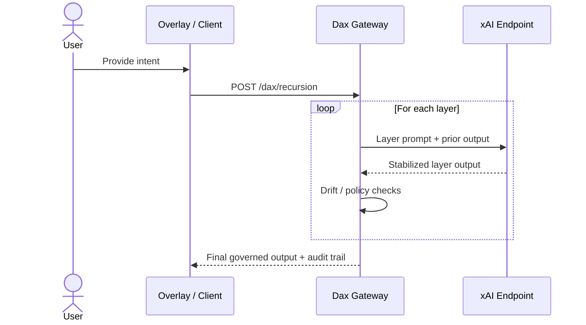

# DA-13 / DA-X Overlay & Integration Guide

This guide packages the minimal code and step-by-step instructions required to layer the DA-13 + DA-X governance stack ("Dax") on top of other systems. It is framework-agnostic and assumes zero existing dependencies.

## Architecture snapshot
- **DA-13 → DA-1**: Sequential refinement layers that enforce governance, policy validation, and terminal action discipline.
- **DA-X core**: Recursive stability guard that halts or re-centers outputs when drift is detected.
- **Execution loop**: Each layer receives the previous output, applies its role-specific prompt, and returns a stabilized string. The final output is emitted only after all layers are stable.

## Minimal Overlay Snippet (Browser / WebView)
Embed this in any HTML surface to run the full stack. Route model calls through a backend proxy that attaches your XAI key (never expose it to the browser). Layer prompts are pulled from `config/layers.json`, so you can adjust governance per domain without touching code.


## Minimal overlay snippet (browser / WebView)
Embed this in any HTML surface to run the full stack. Replace `YOUR_XAI_API_KEY` with a secret provided via environment injection or server-side templating. Layer prompts are pulled from `config/layers.json`, so you can adjust governance per domain without touching code.

```html
<div id="dax-overlay">
  <textarea id="dax-input" placeholder="Enter intent"></textarea>
  <button id="dax-run">Run Dax</button>
  <pre id="dax-log">Ready.</pre>
</div>
<script>
// fetch layer definitions from config to allow per-domain overrides
async function loadLayers() {
  const res = await fetch('/config/layers.json');
  if (!res.ok) throw new Error('Unable to load layer config');
  return res.json();
}

async function runDax(input, { includeReasons = false } = {}) {
  const layers = await loadLayers();
  let current = input;
  const audit = [];

  for (const layer of layers) {
    const instructions = includeReasons
      ? `${layer.prompt}\nRespond as JSON with keys: output (stabilized text) and reason (brief audit note).`
      : `${layer.prompt}\nRespond with only the stabilized text. No meta-commentary.`;

    const payload = {
      model: "grok-4",
      messages: [{ role: "user", content: `You are ${layer.name} acting as ${layer.agent}.\nDuty: ${layer.desc}.\nProtocol: ${instructions}\nPrior output:\n${current}` }],
      temperature: 0.2
    };

    // Call a backend proxy so API keys never reach the browser.
    // Example contract (implement server-side): POST /api/dax-chat { payload }
    // Backend should authenticate the caller, attach the secret XAI key, and stream the response.
    const res = await fetch("/api/dax-chat", {
      method: "POST",
      headers: {
        "Content-Type": "application/json"
      },
      body: JSON.stringify({ payload })
    });

    if (!res.ok) throw new Error(`Layer ${layer.name} failed: HTTP ${res.status}`);
    const data = await res.json();
    const reply = data.choices[0].message.content.trim();

    if (includeReasons) {
      const parsed = JSON.parse(reply);
      current = (parsed.output || '').trim();
      audit.push({ layer: layer.name, reason: parsed.reason || '' });
    } else {
      current = reply;
    }
  }
  return { output: current, audit };
}

document.getElementById("dax-run").onclick = async () => {
  const log = document.getElementById("dax-log");
  log.textContent = "Running...";
  try {
    const { output, audit } = await runDax(document.getElementById("dax-input").value.trim(), { includeReasons: true });
    log.textContent = [output, "---", ...audit.map(a => `${a.layer}: ${a.reason || 'no reason provided'}`)].join("\n");
  } catch (err) {
    log.textContent = err.message;
  }
};
</script>
```

### Notes for the overlay snippet
- **CORS**: If the host does not return permissive CORS headers, route through a vetted proxy (e.g., codetabs.com or a self-hosted `cors-anywhere`) and restrict allowed origins.
- **Secrets**: Do **not** hardcode keys. Inject via server-rendered templates, environment-derived meta tags, or a backend token exchange.
- **Fallback models**: Add a retry path to Grok-3 or a cached response if `HTTP 429/5xx` occurs.
- **Observability**: Emit per-layer timings, failures, and retry counts to your telemetry stack.

### Layer-specific agents and duties
- **DA-13 — Sentinel:** Restate mission intent, anchor on verifiable truth, reject fabrication.
- **DA-12 — Chancellor:** Map to governing policies, resolve conflicts, prevent misaligned intents.
- **DA-11 — Custodian:** Re-rate risk, enforce escalation thresholds, downgrade unsafe intents.
- **DA-10 — Registrar:** Select the correct mandate template, populate only scoped fields.
- **DA-9 — Verifier:** Lint against policy-as-code rules, block disallowed operations.
- **DA-8 — Auditor:** Attach minimal evidence hooks without leaking PII.
- **DA-7 — Steward:** Decide if human approval is mandatory; annotate rationale.
- **DA-6 — Conductor:** Split tasks, order dependencies, and ensure prerequisites are met.
- **DA-5 — Router:** Map steps to the right adapters/tools; avoid unsupported actions.
- **DA-4 — Observer:** Request only essential telemetry; avoid sensitive data.
- **DA-3 — Sentry:** Detect contradictions/bias/drift; halt or raise alerts if present.
- **DA-2 — Inspector:** Self-audit structure for coherence, completeness, and redundancy removal.
- **DA-1 — Executor:** Emit the final action text only; no meta-commentary.
- **DA-X — Anchor:** Final stability check with rollback/halt on anomalies.

## Backend / service integration
1. **Wrap the recursion** in a server function (Node, Python, Go) that accepts `input` and returns the stabilized string. This keeps API keys server-side.
2. **Expose an internal endpoint** `/dax/recursion` for front-ends to call. Enforce auth (JWT/session) and rate limits.
3. **Logging & evidence**: Persist per-layer inputs/outputs for DA-8 evidence trails and DA-3 anomaly alerts.
4. **Safety guards**: Add timeouts and per-layer circuit breakers; cap message length to prevent runaway costs.

## Integration playbooks
- **Web apps**: Mount the overlay in a modal or side panel; stream per-layer status updates to the UI via SSE/WebSocket.
- **Mobile**: Use a WebView with the overlay snippet or call the backend endpoint directly and render a stepper UI in native components.
- **CLI**: Package the recursion loop as a command (`dax run "prompt"`) returning the final stabilized output and a JSON trace of layer transitions.
- **Agent frameworks**: Register Dax as a tool that transforms prompts before action selection; enforce DA-7 human gates before terminal actions.

## Development & testing checklist
- Run unit tests for the recursion loop with canned layer outputs.
- Simulate drift by injecting faulty layer responses and verify DA-X halts or re-centers.
- Validate CORS/proxy routing in staging before exposing to production origins.
- Add observability: latency per layer, failure counts, and retry rates.

## Security considerations
- Keep API keys off the client; rotate regularly.
- Restrict outbound hosts from proxies; pin TLS where possible.
- Sanitize and log inputs to support DA-8 evidence and incident reviews.

## Next Steps
- Add schema validation around `reason` responses to avoid malformed JSON from providers.
- Publish quickstart unit tests that exercise the SDK transports and layer override paths.
- Package a CLI wrapper that shells the SDKs and emits NDJSON traces for observability stacks.
- Use [`docs/ANTHROPIC_HANDOFF.md`](ANTHROPIC_HANDOFF.md) when preparing a red-team engagement (e.g., Anthropic) to ensure prompts, surfaces, and evidence hooks match what evaluators will hit.
- Track enterprise hardening tasks via [`docs/ENTERPRISE_TODO.md`](ENTERPRISE_TODO.md) before rolling into production environments.
## Next steps
- Parameterize layer prompts via config to tailor governance per domain.
- Add optional `reason` side-channel from each layer for audit-only logs.
- Provide SDK wrappers (JavaScript/Python) that expose `runDax()` with pluggable transport and retry policies.
